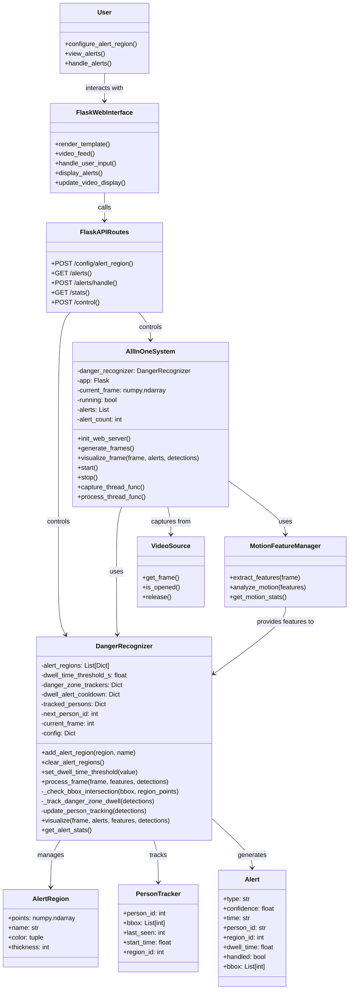
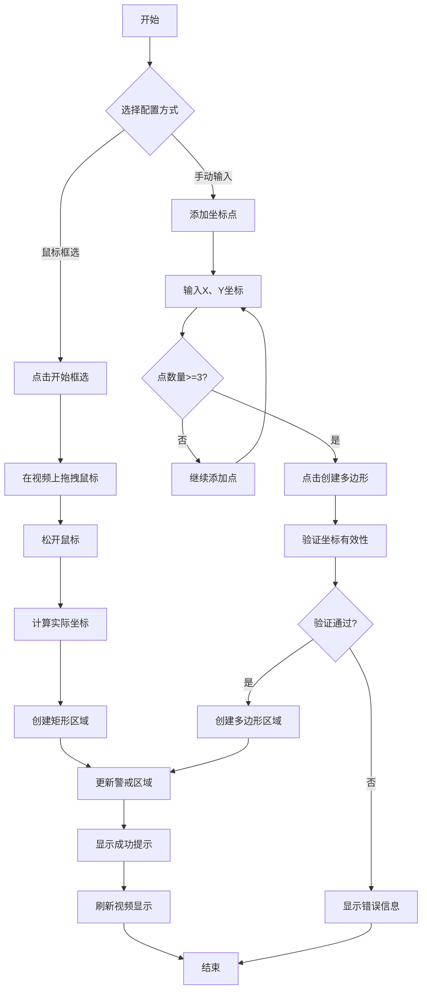
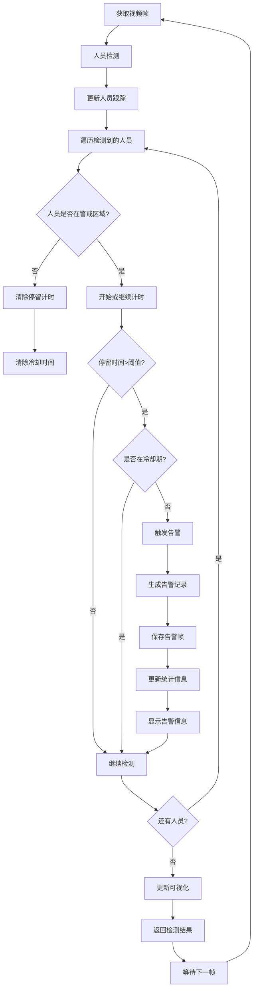
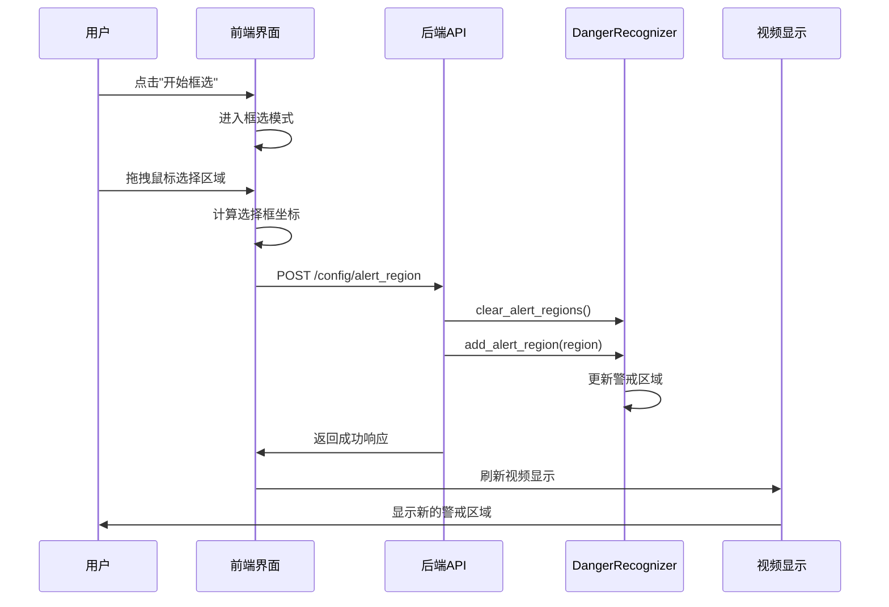
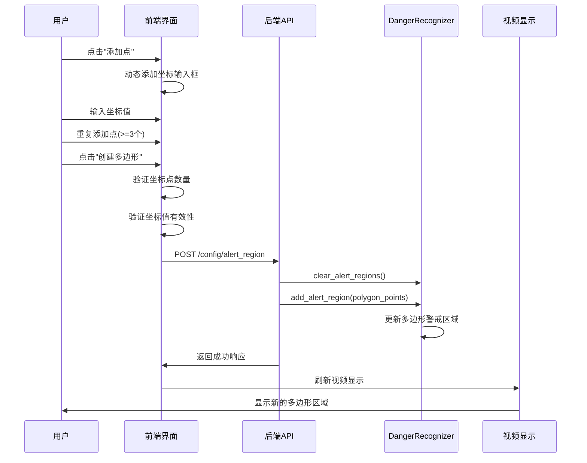
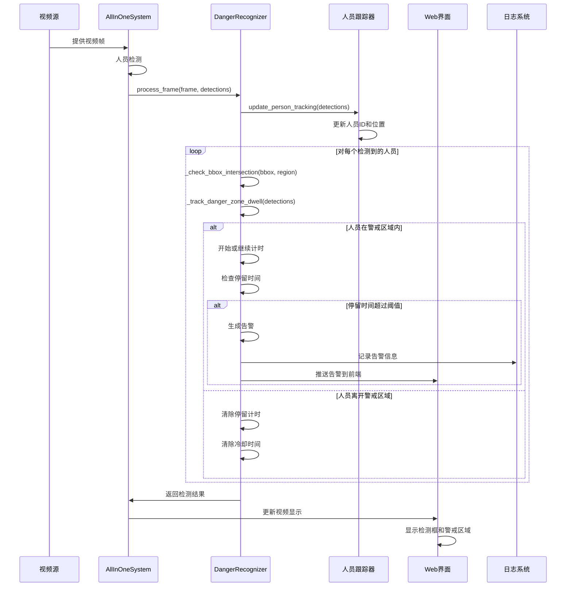
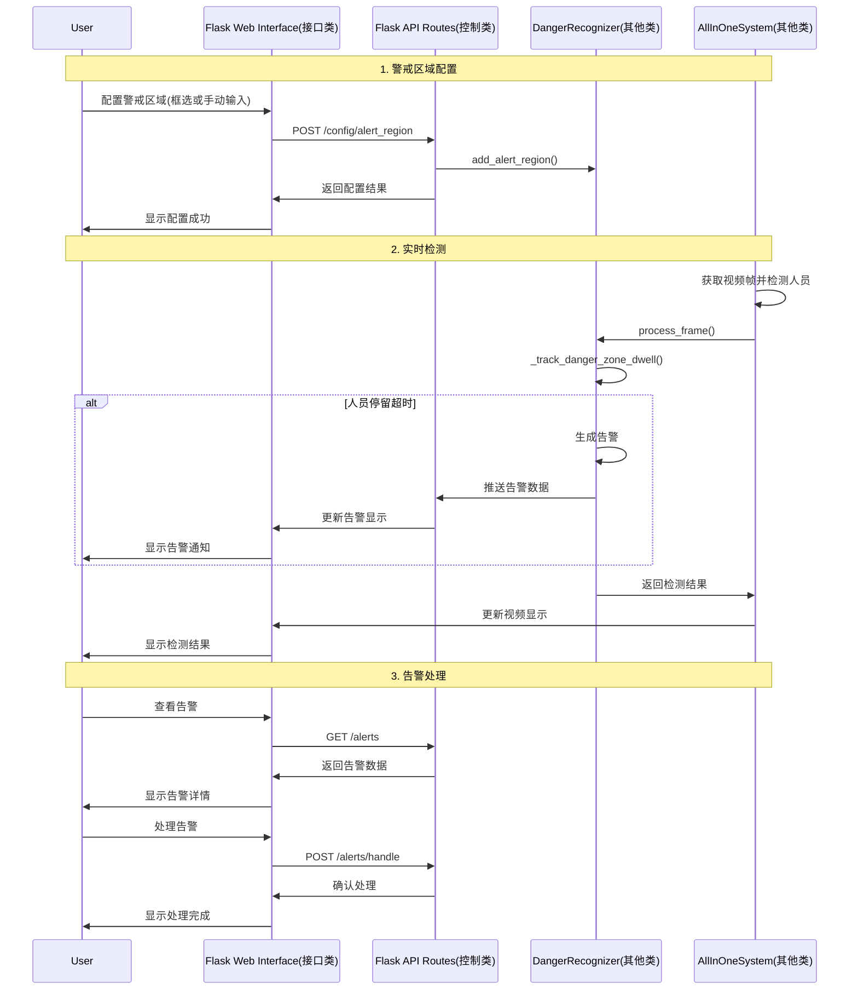

# 危险区域（警戒区域）检测功能详细设计文档

## 1. 功能概述

危险区域检测是视频监控系统的核心功能之一，用于检测人员是否进入预设的警戒区域并在其中停留超过指定时间阈值。系统支持多种警戒区域配置方式，包括鼠标框选矩形区域和手动输入坐标点创建多边形区域。

## 2. 功能点分析

### 2.1 核心功能点

#### 2.1.1 警戒区域配置
- **矩形区域框选**：通过鼠标在视频画面上拖拽框选矩形警戒区域
- **多边形区域创建**：通过手动输入坐标点创建任意形状的多边形警戒区域
- **区域管理**：支持添加、删除、重置警戒区域
- **区域可视化**：在视频画面上实时显示警戒区域边界

#### 2.1.2 停留时间检测
- **时间阈值设置**：可配置人员在警戒区域内的停留时间阈值
- **实时跟踪**：跟踪每个人员在警戒区域内的停留时间
- **告警触发**：当停留时间超过阈值时触发告警
- **冷却机制**：防止重复告警的冷却时间机制

#### 2.1.3 碰撞检测
- **边界框检测**：检测人员检测框与警戒区域的重叠
- **多级检测**：检测边界框的角点、中心点与区域的关系
- **精确判断**：使用OpenCV的pointPolygonTest进行精确检测

#### 2.1.4 人员跟踪
- **唯一标识**：为每个检测到的人员分配唯一ID
- **轨迹跟踪**：跟踪人员在视频中的移动轨迹
- **状态管理**：管理人员的进入、停留、离开状态

### 2.2 辅助功能点

#### 2.2.1 用户界面
- **Web界面**：提供直观的Web配置界面
- **实时反馈**：实时显示检测结果和告警信息
- **配置面板**：提供警戒区域和时间阈值的配置面板

#### 2.2.2 数据管理
- **告警记录**：记录所有危险区域停留告警
- **统计信息**：提供告警统计和处理状态
- **历史查询**：支持历史告警记录的查询

## 3. 操作流程

### 3.1 警戒区域配置流程

#### 3.1.1 矩形区域框选流程
```
1. 用户点击"开始框选"按钮
2. 系统进入框选模式，鼠标变为十字光标
3. 用户在视频画面上按下鼠标左键
4. 用户拖拽鼠标选择矩形区域
5. 用户松开鼠标左键
6. 系统计算实际视频坐标
7. 系统创建矩形警戒区域
8. 系统显示配置成功提示
9. 视频画面显示新的警戒区域
```

#### 3.1.2 多边形区域创建流程
```
1. 用户在"手动输入坐标点"区域点击"添加点"
2. 系统动态添加坐标点输入框
3. 用户为每个点输入X、Y坐标值
4. 用户重复步骤1-3，至少添加3个点
5. 用户点击"创建多边形"按钮
6. 系统验证坐标点数量（至少3个点）
7. 系统验证坐标值有效性
8. 系统创建多边形警戒区域
9. 系统显示配置成功提示
10. 视频画面显示新的警戒区域
```

### 3.2 危险区域检测流程

#### 3.2.1 实时检测流程
```
1. 系统获取当前视频帧
2. 系统进行人员检测，获取检测框信息
3. 系统更新人员跟踪信息
4. 对每个检测到的人员：
   a. 检查检测框是否与警戒区域重叠
   b. 如果重叠，开始或继续计时
   c. 如果离开，清除计时信息
5. 检查停留时间是否超过阈值
6. 如果超过阈值且未在冷却期，触发告警
7. 更新告警统计信息
8. 返回检测结果
```

#### 3.2.2 告警处理流程
```
1. 系统检测到危险区域停留告警
2. 系统生成告警记录，包含：
   - 告警类型：Danger Zone Dwell
   - 告警时间
   - 人员ID
   - 停留时间
   - 警戒区域信息
3. 系统保存告警帧图像
4. 系统更新告警统计
5. 系统在Web界面显示告警信息
6. 用户查看告警详情
7. 用户标记告警为已处理
8. 系统更新告警状态
```

## 4. 类图设计



**类说明：**
- **User**: 用户类，代表系统使用者
- **FlaskWebInterface**: Flask Web界面类（接口类），负责用户交互
- **FlaskAPIRoutes**: Flask API路由类（控制类），负责业务流程控制
- **DangerRecognizer**: 危险识别核心逻辑类（其他类）
- **AllInOneSystem**: 系统主控制器类（其他类）
- **AlertRegion**: 警戒区域数据类
- **PersonTracker**: 人员跟踪数据类
- **Alert**: 告警数据类
- **VideoSource**: 视频源类
- **MotionFeatureManager**: 运动特征管理器类

## 5. 活动图设计

### 5.1 警戒区域配置活动图



### 5.2 危险区域检测活动图



## 6. 时序图设计

### 6.1 警戒区域配置时序图



### 6.2 多边形区域创建时序图



### 6.3 危险区域检测时序图



### 6.4 合并时序图（警戒区域检测完整流程）



**类别说明：**
- **接口类**：Flask Web Interface(F) - 负责用户交互和界面显示
- **控制类**：Flask API Routes(B) - 负责业务流程控制和协调
- **其他类**：
  - DangerRecognizer(D) - 危险识别核心逻辑
  - AllInOneSystem(A) - 系统主控制器

## 7. 数据结构设计

### 7.1 警戒区域数据结构
```python
AlertRegion = {
    'points': numpy.ndarray,  # 区域顶点坐标 [[x1,y1], [x2,y2], ...]
    'name': str,              # 区域名称
    'color': tuple,           # 显示颜色 (B,G,R)
    'thickness': int          # 边界线粗细
}
```

### 7.2 人员跟踪数据结构
```python
PersonTracker = {
    'person_id': int,         # 人员唯一ID
    'bbox': List[int],        # 边界框 [x1,y1,x2,y2]
    'last_seen': int,         # 最后出现帧号
    'start_time': float,      # 进入区域时间
    'region_id': int          # 所在区域ID
}
```

### 7.3 告警数据结构
```python
Alert = {
    'type': str,              # 告警类型
    'confidence': float,      # 置信度
    'time': str,              # 告警时间
    'person_id': str,         # 触发人员ID
    'region_id': int,         # 触发区域ID
    'dwell_time': float,      # 停留时间
    'handled': bool,          # 是否已处理
    'bbox': List[int]         # 人员边界框
}
```

## 8. 算法设计

### 8.1 碰撞检测算法
```python
def _check_bbox_intersection(bbox, region_points):
    """
    检查边界框是否与警戒区域重叠
    
    算法步骤：
    1. 检查边界框的四个角点是否在区域内
    2. 检查边界框的中心点是否在区域内
    3. 检查边界框与区域的外接矩形是否重叠
    """
    x1, y1, x2, y2 = bbox
    
    # 步骤1：检查角点
    corners = [(x1, y1), (x2, y1), (x2, y2), (x1, y2)]
    for corner in corners:
        if cv2.pointPolygonTest(region_points, corner, False) >= 0:
            return True
    
    # 步骤2：检查中心点
    center_x = (x1 + x2) // 2
    center_y = (y1 + y2) // 2
    if cv2.pointPolygonTest(region_points, (center_x, center_y), False) >= 0:
        return True
    
    # 步骤3：检查外接矩形重叠
    bbox_rect = [x1, y1, x2, y2]
    region_rect = cv2.boundingRect(region_points)
    
    if (bbox_rect[0] < region_rect[0] + region_rect[2] and
        bbox_rect[0] + bbox_rect[2] > region_rect[0] and
        bbox_rect[1] < region_rect[1] + region_rect[3] and
        bbox_rect[1] + bbox_rect[3] > region_rect[1]):
        return True
    
    return False
```

### 8.2 停留时间跟踪算法
```python
def _track_danger_zone_dwell(object_detections):
    """
    跟踪危险区域停留时间
    
    算法步骤：
    1. 遍历所有检测到的人员
    2. 检查每个人员是否在警戒区域内
    3. 如果在区域内，开始或继续计时
    4. 如果离开区域，清除计时信息
    5. 检查停留时间是否超过阈值
    6. 触发告警并设置冷却时间
    """
    current_time = time.time()
    alerts = []
    
    for obj in object_detections:
        if obj['class'] != 'person':
            continue
            
        bbox = obj['bbox']
        object_id = f"person_{hash(tuple(bbox))}"
        
        # 检查是否在警戒区域内
        in_danger_zone = False
        region_id = None
        
        for i, region in enumerate(self.alert_regions):
            if self._check_bbox_intersection(bbox, region['points']):
                in_danger_zone = True
                region_id = i
                break
        
        if in_danger_zone:
            # 在区域内，开始或继续计时
            if object_id not in self.danger_zone_trackers:
                self.danger_zone_trackers[object_id] = {
                    'start_time': current_time,
                    'region_id': region_id
                }
            else:
                # 检查停留时间
                dwell_time = current_time - self.danger_zone_trackers[object_id]['start_time']
                if (dwell_time >= self.dwell_time_threshold_s and 
                    object_id not in self.dwell_alert_cooldown):
                    # 触发告警
                    alert = self._create_dwell_alert(object_id, region_id, dwell_time)
                    alerts.append(alert)
                    self.dwell_alert_cooldown[object_id] = self.current_frame
        else:
            # 离开区域，清除跟踪
            if object_id in self.danger_zone_trackers:
                del self.danger_zone_trackers[object_id]
            if object_id in self.dwell_alert_cooldown:
                del self.dwell_alert_cooldown[object_id]
    
    return alerts
```

## 9. 性能优化

### 9.1 检测优化
- **外接矩形预检**：先检查边界框与区域外接矩形是否重叠，减少精确计算
- **多级检测**：从粗到精的检测策略，提高检测效率
- **缓存机制**：缓存检测结果，避免重复计算

### 9.2 内存优化
- **对象池**：重用检测对象，减少内存分配
- **定期清理**：定期清理过期的跟踪记录和冷却时间
- **数据压缩**：压缩存储的告警数据

### 9.3 并发优化
- **线程安全**：使用锁机制保护共享数据
- **异步处理**：异步处理告警生成和保存
- **队列缓冲**：使用队列缓冲检测结果

## 10. 安全考虑

### 10.1 数据安全
- **输入验证**：严格验证用户输入的坐标值
- **边界检查**：检查坐标值是否在合理范围内
- **异常处理**：完善的异常处理机制

### 10.2 系统安全
- **访问控制**：限制对配置接口的访问
- **日志记录**：记录所有配置操作和告警事件
- **数据备份**：定期备份配置和告警数据

## 11. 扩展性设计

### 11.1 功能扩展
- **多区域支持**：支持同时配置多个警戒区域
- **区域优先级**：支持设置区域优先级
- **动态区域**：支持动态调整区域大小和位置

### 11.2 算法扩展
- **机器学习**：集成机器学习算法提高检测精度
- **深度学习**：使用深度学习模型进行人员检测
- **行为分析**：增加行为分析功能

### 11.3 接口扩展
- **API接口**：提供RESTful API接口
- **第三方集成**：支持与第三方系统集成
- **移动端支持**：开发移动端应用

## 12. 测试策略

### 12.1 单元测试
- **算法测试**：测试碰撞检测算法
- **边界测试**：测试边界条件
- **异常测试**：测试异常情况处理

### 12.2 集成测试
- **端到端测试**：测试完整的功能流程
- **性能测试**：测试系统性能
- **压力测试**：测试系统稳定性

### 12.3 用户测试
- **可用性测试**：测试用户界面易用性
- **功能测试**：测试功能完整性
- **兼容性测试**：测试不同环境兼容性 