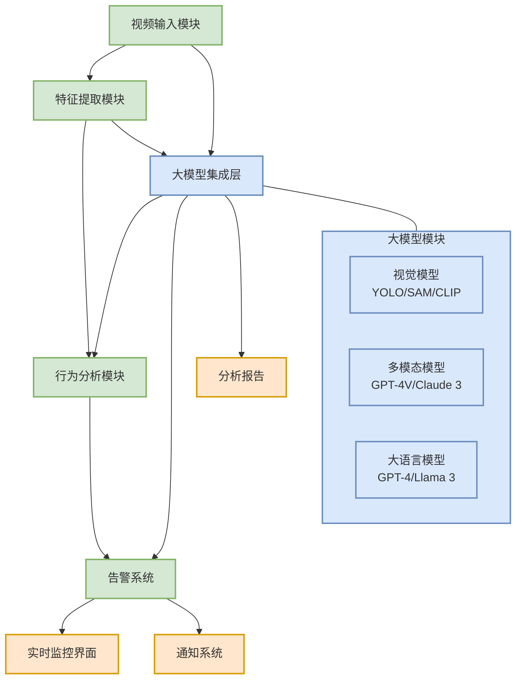

# 视频监控危险行为检测系统文档

欢迎使用视频监控危险行为检测系统文档！本文档提供了系统的详细信息，包括安装说明、使用指南、API参考和开发者文档。

## 文档索引

- [快速入门指南](docs/QUICK_START.md)
- [API参考文档](docs/API_REFERENCE.md)
- [开发者指南](docs/DEVELOPER_GUIDE.md)
- [大模型集成指南](docs/AI_INTEGRATION_GUIDE.md)

## 系统架构

### 基础架构

### AI增强架构

我们的系统集成了先进的AI大模型能力，以提高危险行为识别的准确性和智能性：

AI增强架构将视觉大模型、多模态大模型和大语言模型无缝集成到现有的视频监控系统中，提供以下增强功能：

- 精确物体识别与跟踪
- 深度场景理解与上下文分析
- 智能告警分析与误报过滤
- 自然语言告警解释与建议

如需了解更多有关AI集成的详细信息，请参阅[大模型集成指南](docs/AI_INTEGRATION_GUIDE.md)。

## 许可证

本项目采用MIT许可证。详见[LICENSE](LICENSE)文件。

## 联系方式

如有任何问题或建议，请联系开发团队或提交issue。 