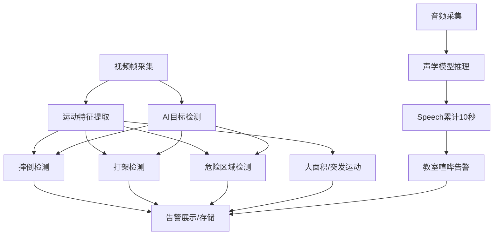

# Behavior Detection

本文件详细说明本系统中各类行为检测与声学检测的原理、实现细节及参数说明。

---

## 1. 系统总览

本系统集成了基于视频的行为检测与基于音频的异常检测。系统实时处理视频和音频流，分析人员行为和声音事件，针对异常或危险情况生成告警。

### 主要处理流程

---

## 2. 视频行为检测

### 检测逻辑详解

#### 2.1 摔倒检测（Fall Detection）

**核心逻辑：**
1. **运动特征分析**  
   - 计算连续帧的运动向量，提取垂直和水平运动分量。
   - 检查是否存在大幅度的垂直向下运动（如 max_vertical_motion > 15）。
   - 检查运动后是否突然静止（如 earlier_avg > 5 且 recent_avg < 1.5）。
   - 检查特征点数量是否突增（如当前特征点数 > 1.5 × 前一帧且 > 5）。
   - 检查垂直/水平运动是否持续多帧。
2. **AI辅助判据**  
   - 使用目标检测（如YOLOv8）定位“person”对象，获取其边框（bbox）。
   - 计算宽高比 w/h，若 w/h > 1.2 且当前高度 < 历史最大高度的 0.65，判为倒地。
   - 或者，bbox底部接近画面底部（y2 > frame_height × 0.88）也判为倒地。
   - 若当前高度 > 历史最大高度的 0.85（如起立），则排除摔倒。
3. **置信度与冷却**  
   - 置信度累加达到 0.8~0.95（多条件组合），且倒地判据成立，且冷却时间已过，才生成摔倒告警。

#### 2.2 打架检测（Fighting Detection）

**核心逻辑：**
1. **多人人员检测**  
   - 画面中检测到至少两个人。
2. **距离与重叠分析**  
   - 计算两人中心点距离、边框重叠面积。
   - 距离小于阈值（如 distance_threshold），重叠面积大于一定比例，判为接近。
3. **运动强度分析**  
   - 统计两人间的平均运动幅度（如 flow_mean_magnitude）。
   - 若运动强度高且持续多帧，判为疑似打架。
4. **时序一致性**  
   - 只有上述特征持续多帧（如3帧以上），才生成打架告警。

#### 2.3 危险区域入侵与停留（Danger Zone Intrusion & Dwell）

**核心逻辑：**
1. **区域定义**  
   - 用户通过参数自定义多边形危险区域。
2. **入侵检测**  
   - 检查每个人员的bbox中心点是否落在区域内。
3. **停留检测**  
   - 记录每个人员进入区域的时间戳。
   - 若停留时间超过 dwell_time_threshold（如1秒），生成停留告警。

#### 2.4 大面积/突发运动（Large Area & Sudden Motion）

**核心逻辑：**
1. **大面积运动**  
   - 统计运动特征点/像素占全画面的比例。
   - 若比例超过 area_threshold（如0.05），计为一次大面积运动事件（仅统计，不直接告警）。
2. **突发运动**  
   - 计算当前帧与前一帧的特征点数量变化率。
   - 若变化率超过 feature_change_ratio（如1.5），计为一次突发运动事件（仅统计）。

---

## 3. 声学检测（教室喧哗）

### 检测逻辑详解

#### 3.1 教室喧哗检测（Classroom Noise）

**核心逻辑：**
1. **音频采集与推理**  
   - 实时采集麦克风音频，送入YAMNet声学模型推理。
2. **标签判据**  
   - 只要“Speech”标签分数高于 NOISE_DETECT_THRESHOLD（如0.01），即认为有说话声。
3. **累计时长**  
   - 若“Speech”持续累计超过 NOISE_ACCUM_SECONDS（如10秒），则生成“Classroom Noise”告警。
   - 只要中断，累计清零。
4. **不区分人数**  
   - 无论一人还是多人说话，只要持续达到时长即告警。

---

## 4. 音视频联动
- 视频与音频模块的告警会统一展示和存储。
- 若同一时段既有行为告警（如摔倒、打架）又有教室喧哗告警，声学标签会合并进告警详情，辅助事件判读。

---

## 5. 关键参数说明

| 参数名                    | 说明                                      |
|--------------------------|------------------------------------------|
| --feature_threshold      | 运动特征点数量阈值，低于此值不分析         |
| --area_threshold         | 大面积运动判据阈值                        |
| --alert_cooldown         | 同类告警冷却时间，防止重复报警             |
| --min_confidence         | 行为告警最小置信度                        |
| --distance_threshold     | 打架检测人员距离阈值                      |
| --dwell_time_threshold   | 危险区域停留最短时间（秒）                |
| --alert_region           | 自定义危险区域多边形坐标                  |
| --ai_interval            | AI目标检测帧间隔                          |
| --ai_confidence          | AI检测最小置信度                          |
| --enable_audio_monitor   | 是否启用声学异常检测                      |
| NOISE_DETECT_THRESHOLD   | 声音检测置信度阈值                        |
| NOISE_ACCUM_SECONDS      | 教室喧哗累计时长阈值（秒）                |

---

## 6. 告警展示与管理
- 所有告警会在Web界面实时展示并存储历史。
- 每条告警包含：时间、类型、置信度、位置、触发对象、声学检测结果等。
- 支持告警处理、历史查询、图片查看等功能。

---

如需进一步了解算法细节、参数调优或自定义检测逻辑，请参考开发者指南或联系项目维护者。 