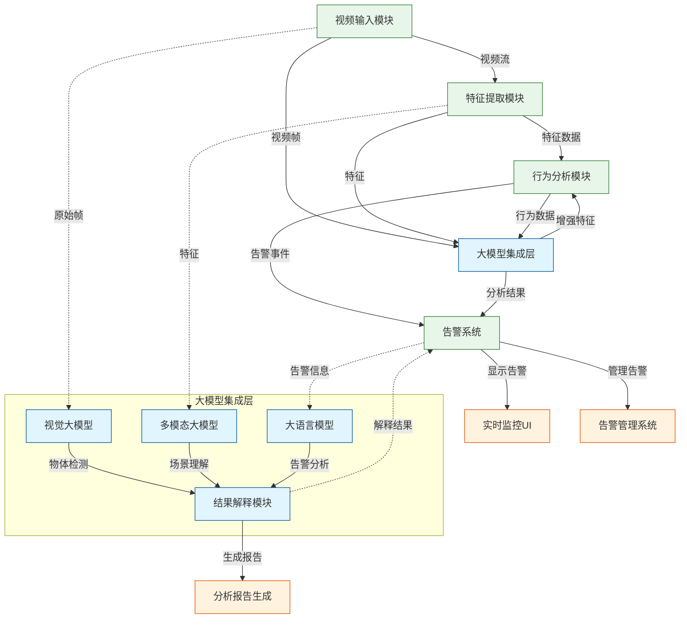

```mermaid
graph TD
    %% 主要组件
    A[视频输入模块] -->|视频流| B[特征提取模块]
    B -->|特征数据| C[行为分析模块]
    C -->|告警事件| D[告警系统]
    
    %% AI模块集成
    E[大模型集成层]
    A -->|视频帧| E
    B -->|特征| E
    C -->|行为数据| E
    E -->|分析结果| D
    E -->|增强特征| C
    
    %% AI子模块
    subgraph 大模型集成层
        F[视觉大模型] -->|物体检测| I[结果解释模块]
        G[多模态大模型] -->|场景理解| I
        H[大语言模型] -->|告警分析| I
    end
    
    %% 数据流
    A -.->|原始帧| F
    B -.->|特征| G
    D -.->|告警信息| H
    I -.->|解释结果| D
    
    %% 外部接口
    J[实时监控UI]
    K[告警管理系统]
    L[分析报告生成]
    
    D -->|显示告警| J
    D -->|管理告警| K
    I -->|生成报告| L
    
    %% 样式
    classDef default fill:#f9f9f9,stroke:#333,stroke-width:1px
    classDef aiModule fill:#e1f5fe,stroke:#01579b,stroke-width:1px
    classDef core fill:#e8f5e9,stroke:#2e7d32,stroke-width:1px
    classDef interface fill:#fff3e0,stroke:#e65100,stroke-width:1px
    
    class E,F,G,H,I aiModule
    class A,B,C,D core
    class J,K,L interface
``` 