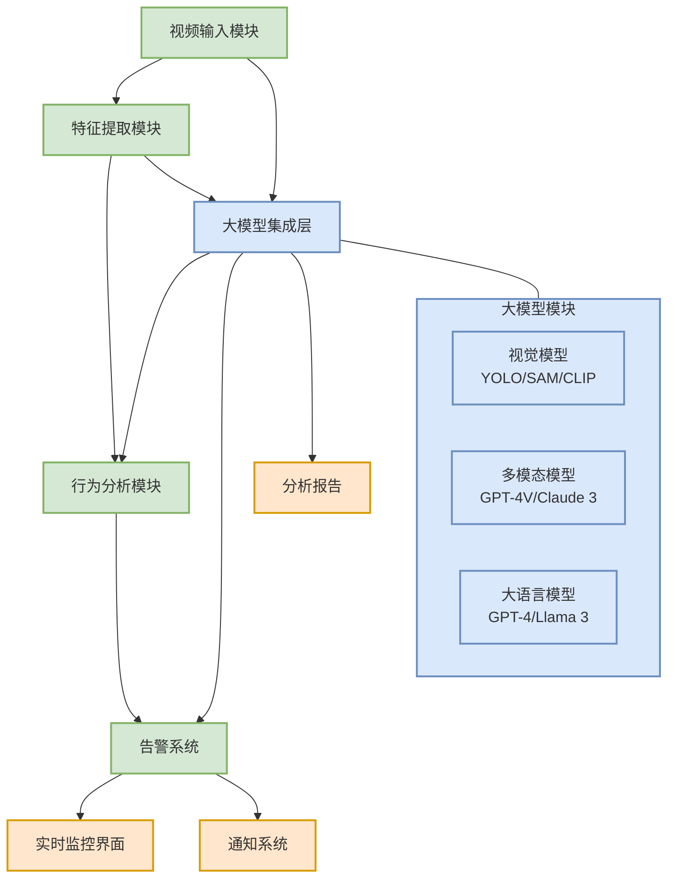

```mermaid
flowchart TD
    %% 核心组件
    VideoInput[视频输入模块] --> FeatureExtraction[特征提取模块]
    FeatureExtraction --> BehaviorAnalysis[行为分析模块]
    BehaviorAnalysis --> AlertSystem[告警系统]
    
    %% AI模块
    AILayer[大模型集成层]
    
    %% 连接关系
    VideoInput --> AILayer
    FeatureExtraction --> AILayer
    AILayer --> BehaviorAnalysis
    AILayer --> AlertSystem
    
    %% AI子组件
    subgraph AIModels[大模型模块]
        VisionModels[视觉模型\nYOLO/SAM/CLIP]
        MultimodalModels[多模态模型\nGPT-4V/Claude 3]
        LLMs[大语言模型\nGPT-4/Llama 3]
    end
    
    AILayer --- AIModels
    
    %% 输出接口
    AlertSystem --> UI[实时监控界面]
    AlertSystem --> Notification[通知系统]
    AILayer --> Reports[分析报告]
    
    %% 样式定义
    classDef core fill:#d5e8d4,stroke:#82b366,stroke-width:2px
    classDef ai fill:#dae8fc,stroke:#6c8ebf,stroke-width:2px
    classDef output fill:#ffe6cc,stroke:#d79b00,stroke-width:2px
    
    class VideoInput,FeatureExtraction,BehaviorAnalysis,AlertSystem core
    class AILayer,AIModels,VisionModels,MultimodalModels,LLMs ai
    class UI,Notification,Reports output
``` 